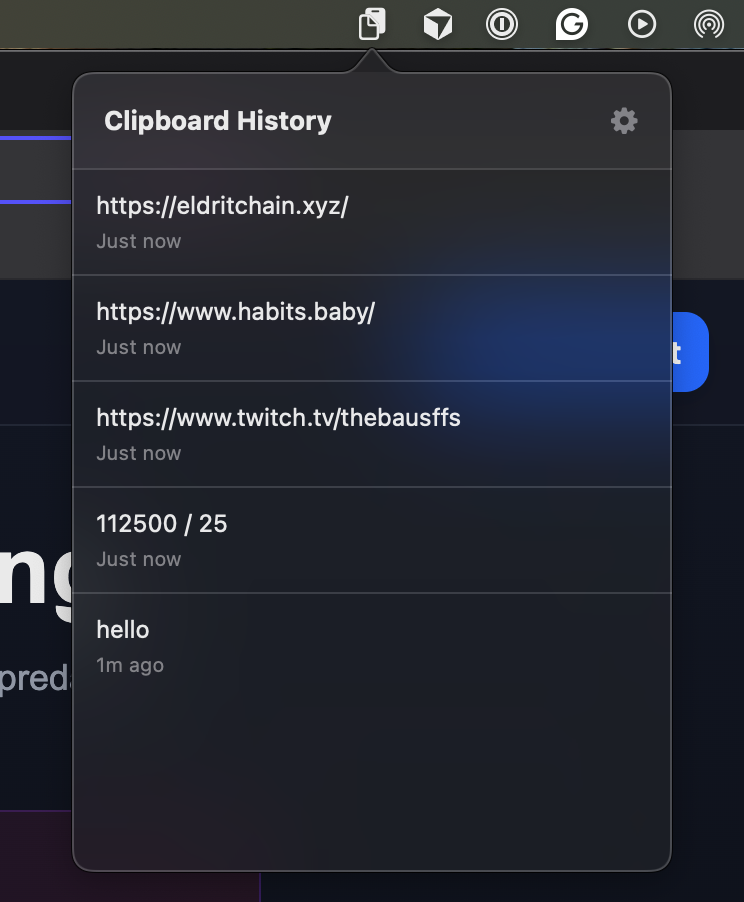
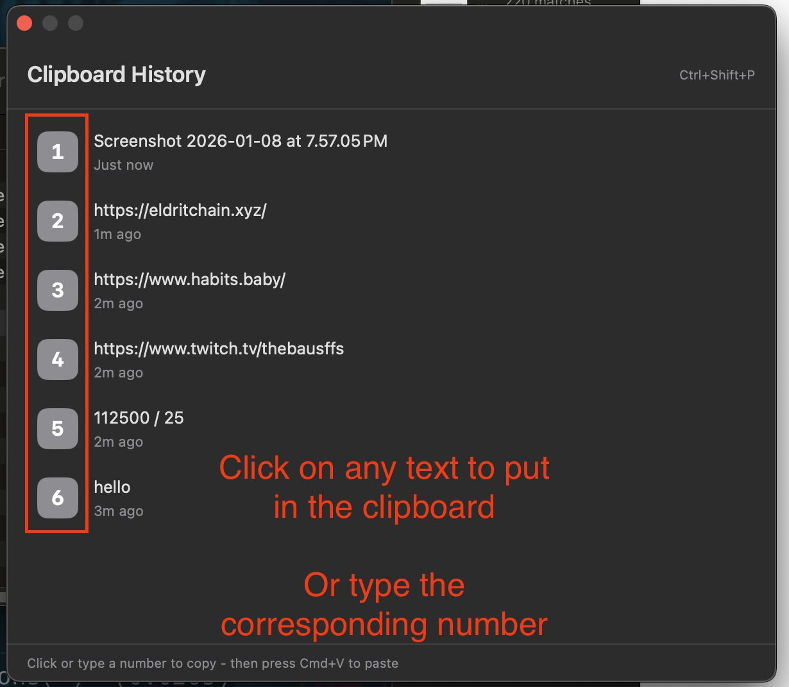

# Clipboard Manager for macOS

<div align="center">

[](https://github.com/sdaveas/clipboard/releases/latest/download/ClipboardManager.zip)

**Never lose what you copied again.**

A lightweight, native macOS menu bar app that remembers your clipboard history.


</div>

---

## ✨ What is this?

Clipboard Manager is a simple tool that sits quietly in your macOS menu bar and keeps track of everything you copy. Need to paste something you copied 5 minutes ago? No problem. It's all there, ready to use.

<div align="center">

<table>
<tr>
<td width="50%" align="center">
<h3>Menu Bar Interface</h3>
</td>
<td width="50%" align="center">
<h3>Quick Access Panel (Ctrl+Shift+P)</h3>
</td>
</tr>
<tr>
<td align="center">

</td>
<td align="center">

</td>
</tr>
</table>

</div>

## 🚀 Getting Started

### Quick Install (One Command)

Open Terminal and run:

```bash
curl -L https://github.com/sdaveas/clipboard/releases/latest/download/ClipboardManager.zip -o /tmp/ClipboardManager.zip && \
unzip -o /tmp/ClipboardManager.zip -d /Applications && \
xattr -cr /Applications/ClipboardManager.app && \
open /Applications/ClipboardManager.app && rm /tmp/ClipboardManager.zip
```

This will:
- Download the latest release
- Unzip it
- Copy to Applications folder
- Remove quarantine attributes
- Launch the app

You'll see a clipboard icon appear in your menu bar 📋

### Manual Installation

1. **Download** the latest release:
   - Click the blue "Download" badge above, or
   - Go to [Releases](https://github.com/sdaveas/clipboard/releases/latest) and download `ClipboardManager.zip`

2. **Install** the app:
   - Unzip the downloaded file
   - Drag `ClipboardManager.app` to your Applications folder

3. **Remove quarantine** (required for unsigned apps):
   - Open **Terminal** (press **Cmd+Space**, type "Terminal", and press Enter)
   - Copy and paste this command:
     ```bash
     xattr -cr /Applications/ClipboardManager.app
     ```
   - Press **Enter**
   
   > **Note**: This is a **one-time step** needed only for the first installation. It tells macOS to trust the app.

4. **Launch** the app:
   - Open it from your Applications folder
   - You'll see a clipboard icon appear in your menu bar 📋

### Make it Start Automatically on Login (Optional)

To have ClipboardManager launch automatically when you start your Mac:

1. Look for **Login Items** in Spotlight
2. Click the **"+"** button
3. Navigate to your **Applications** folder
4. Select **ClipboardManager.app** and click **Add**

Now the app will automatically start every time you log in!

## 💡 How to Use

### Two Ways to Access Your History

**1. Click the menu bar icon** 🖱️
- See all your recent clipboard items with timestamps
- Click any item to copy it again
- Access settings via the gear icon ⚙️

**2. Use the keyboard shortcut** ⌨️
- Press **Ctrl+Shift+P** from anywhere (customizable)
- Type a number or click to select an item
- The item is automatically copied—just press **Cmd+V** to paste
- Press **Esc** to close

### Customize Your Settings

1. Click the menu bar icon
2. Click the **gear icon (⚙️)** in the top-right
3. Adjust:
   - **History Size**: Keep 5-50 items (default: 10)
   - **Keyboard Shortcut**: Change the hotkey to your preference
4. Click **"Apply Shortcut Change"** to save

### Other Options (Right-Click Menu)

- **Clear History**: Wipe all stored clipboard items
- **Restart**: Restart the app
- **Quit**: Close the app completely

## ✅ What You Get

- ✨ **Lightweight & Native**: Built with SwiftUI, feels like part of macOS
- 📝 **Automatic Tracking**: Captures everything you copy, no effort required
- ⏱️ **Smart Timestamps**: "Just now", "5m ago", "1h ago"—know when you copied something
- ⚡ **Lightning Fast**: Quick access via keyboard shortcut or menu bar
- 🎛️ **Fully Customizable**: Adjust history size and keyboard shortcuts to your liking
- 🔒 **Privacy First**: Everything stays on your Mac, no cloud sync
- 🧹 **Clean Interface**: Simple, uncluttered design that stays out of your way

## 🛠️ Building from Source

Want to build it yourself? Easy.

### Quick Build (No Xcode Required)

```bash
./build.sh
open ClipboardManager.app
```

### Using Xcode

1. Open `ClipboardManager.xcodeproj`
2. Press **Cmd+R** to build and run

**Requirements**: macOS 13.0+, Swift 5.0+ (included with Xcode Command Line Tools)

## ❓ FAQ

**Q: Does this work with images or files?**  
A: Currently, only text is supported.

**Q: Where is my clipboard data stored?**  
A: Everything is stored locally on your Mac using UserDefaults. Nothing is sent to the cloud.

**Q: How often does it check for clipboard changes?**  
A: Every 0.5 seconds—fast enough to catch everything, efficient enough not to drain resources.

## 📜 License

MIT License - see [LICENSE](LICENSE) for details.

---

<div align="center">

**Made with ❤️ for macOS users who copy a lot**

</div>
